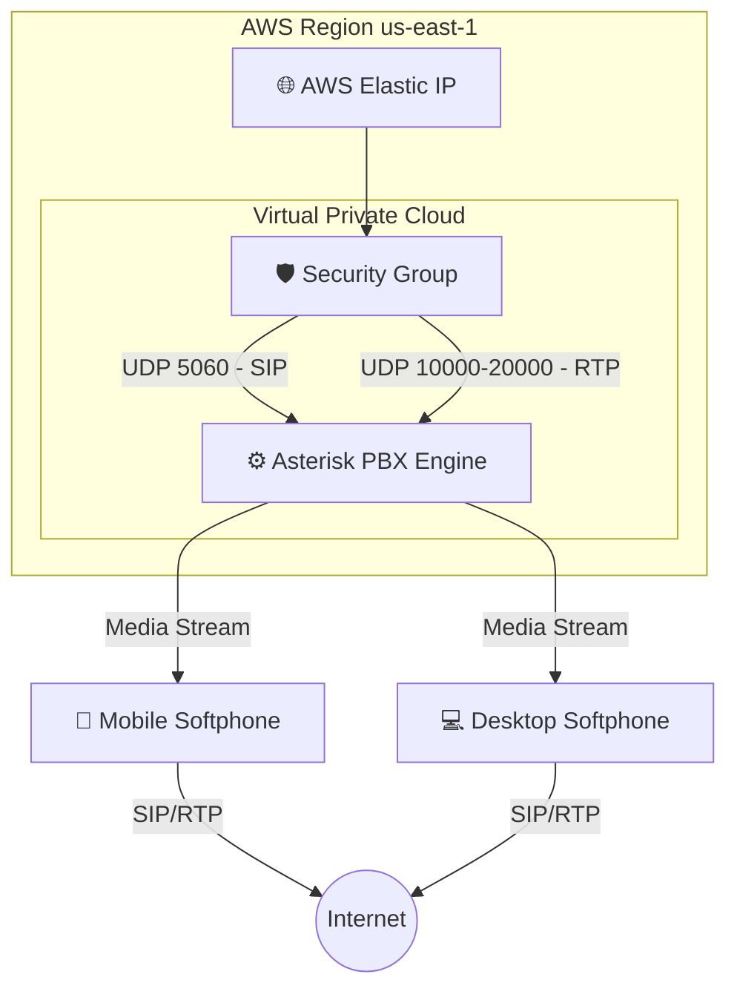

# ☁️ AWS Cloud-Native PBX Infrastructure

> **Enterprise-grade VoIP solution deployed on AWS EC2, featuring HD Audio, H.264 Video Conferencing, and advanced NAT Traversal strategies.**

---

## 📖 Project Overview
Este proyecto no es solo una instalación de Asterisk; es una implementación de **infraestructura de telecomunicaciones en la nube**.

El objetivo principal fue resolver el desafío clásico de VoIP en entornos cloud: **NAT Traversal y Audio Unidireccional**. Utilizando **Asterisk 20** sobre **AWS EC2**, se construyó una central capaz de gestionar extensiones remotas en redes móviles (4G/5G) y WiFi dinámicas sin perder la señalización ni el flujo de medios.

### 🎯 Key Capabilities
* **📹 Videollamadas:** Soporte nativo para codecs H.264 y VP8 (Pass-through).
* **🛡️ Cloud Security:** Firewall granular mediante AWS Security Groups.
* **🌍 Anywhere Access:** Conectividad estable para softphones (Zoiper/Linphone) desde cualquier red global.
* **🔄 High Availability Logic:** Rotación automática de contactos (`max_contacts=3`) para usuarios con múltiples dispositivos.

---

## 🏗️ Diseño de la Arquitectura

El sistema utiliza una arquitectura **Monolítica sobre IaaS** optimizada para baja latencia UDP.

## 🧩 Componentes Técnicos

| Componente | Tecnología | Función Crítica |
| :--- | :--- | :--- |
| **Compute** | AWS EC2 (`t3.micro`) | Alojamiento del Core PBX con optimización de CPU (burstable performance). |
| **Networking** | Elastic IP | Garantiza la persistencia de la IP pública para encabezados SIP correctos. |
| **VoIP Core** | Asterisk 20 + PJSIP | Motor de señalización moderno (reemplaza al obsoleto `chan_sip`). |
| **Firewall** | Security Groups | Whitelisting estricto de puertos UDP. |

---

## 🔧 Engineering Challenges & Solutions

Lo que diferencia a este proyecto es la resolución de problemas reales y complejos de redes en entornos cloud.

### 1. El Problema del *One-Way Audio* (Silencio en un lado)

**Desafío:**  
En AWS, el servidor se encuentra detrás de NAT (IP privada `172.x.x.x` pero salida pública).  
Asterisk enviaba su IP privada en los paquetes **SDP**, provocando pérdida de audio.

**Solución:**  
Implementación de **Elastic IP** y configuración de `external_media_address` en **PJSIP** para reescribir dinámicamente los encabezados SIP.

---

### 2. Conectividad en Redes Móviles (CGNAT)

**Desafío:**  
Los dispositivos móviles cambian constantemente de IP y puertos en redes 4G/5G.

**Solución:**  
Activación de `force_rport` y `rtp_symmetric`, obligando a Asterisk a responder al puerto real desde donde se originó el paquete, ignorando el encabezado SIP del endpoint.

---

### 3. Soporte de Video H.264

**Desafío:**  
La negociación de video suele fallar por incompatibilidad de codecs entre endpoints.

**Solución:**  
Habilitación de `max_video_streams=1` y uso de **modo Pass-through**, permitiendo que los clientes negocien directamente la calidad de video sin transcodificación, reduciendo la carga de CPU del servidor.

## 🛠️ Installation & Setup

Para replicar este despliegue paso a paso, consulta la guía detallada de instalación:

👉 **Ver Guía de Instalación:** [INSTALLATION.md](INSTALLATION.md)

## 👨‍💻 Autor

**Andrés Rodas**  
Informatics Engineering Student – UPCH  

☁️ Cloud Enthusiast  

- 💼 **LinkedIn:** www.linkedin.com/in/andres-rodas-802309272 
- 📧 **Email:** andrescloud18sj@gmail.com
